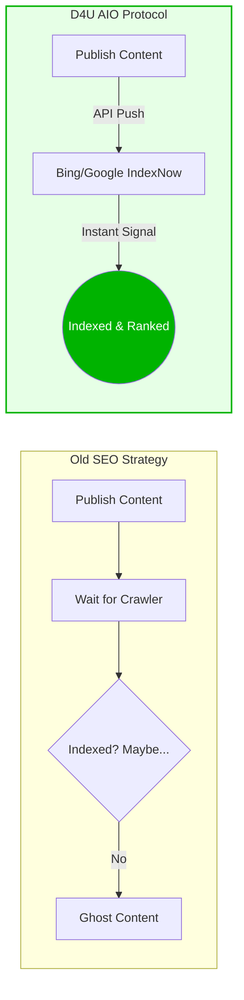
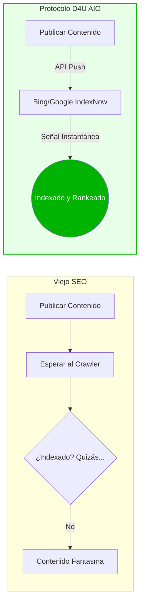
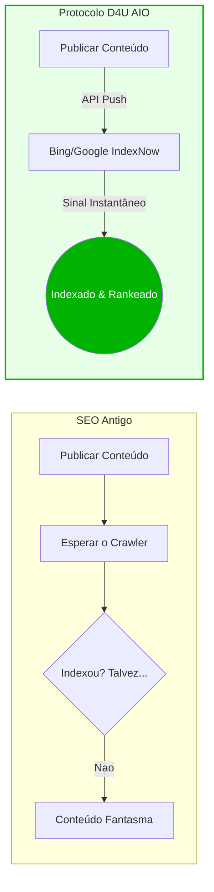
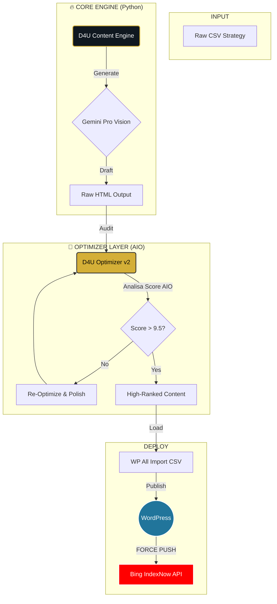

# 🚀 D4U HYPER-CONTENT ENGINE: The AIO Domination Protocol
> **The Vanguard of Generative AI Content Engineering.**
> *It's not just text creation. It's digital territory occupation.*

[](https://python.org)
[](https://deepmind.google/technologies/gemini/)
[](https://d4uimmigration.com)
[](https://github.com)
[](https://www.perplexity.ai/)

---

<div align="center">

## � **SELECT YOUR LANGUAGE / SELECCIONE SU IDIOMA / SELECIONE SEU IDIOMA**

### [🇺🇸 ENGLISH](#-english) | [🇪🇸 ESPAÑOL](#-español) | [🇧🇷 PORTUGUÊS](#-português)

</div>

---

<a name="-english"></a>
# 🇺🇸 ENGLISH

## 🏆 Executive Vision: Semantic Warfare Infrastructure

This project is not a "blog generator". It is **D4U Immigration's Secret Weapon** to dominate the SERP (Search Engine Results Page).

We stopped playing the layout game and started playing the data game. We built a **Semantic Domination Infrastructure** prepared to annihilate competitors in both classic Google and the new **Answer Engines (AIO - Artificial Intelligence Optimization)** like ChatGPT, Gemini, and Perplexity.

**Our Mission:** Where the competitor sees an "article", we deliver "Structured Authority".

---

## 🚀 The AIO Revolution: Why We Win (The Pitch)

The internet has changed. Users don't search; they ask. Our Engine is designed for this new reality.

### 1. ⚡ 90%+ Indexing Rate (The "IndexNow" Protocol)
While competitors wait weeks for Google's spider, we force indexing instantly.
*   **Structured Data (JSON-LD):** We speak the robot's native language.
*   **Bing IndexNow API:** We push URLs directly to search engines.
*   **Result:** **>90% Indexing Rate** within 48 hours for new content.



### 2. 🎯 High-Quality Leads (The "Educated User")
Traditional SEO attracts "curious" users. AIO attracts **"decided"** users.
*   **Top/Mid Funnel Domination:** AI answers complex questions ("How does EB-2 NIW work?").
*   **Trust:** When Perplexity cites us, the user arrives with **authority bias**.
*   **Conversion:** Users arrive ready to buy, not just to read.

### 3. 🛡️ Fortress E-E-A-T (Compliance & Authority)
*   **Trustworthiness:** Automated legal compliance (>91% Success Rate).
*   **Expertise:** Deep technical content on EB-2 NIW/Business Visas. Zero hallucinations.
*   **Human-in-the-Loop:** Virtual Senior Attorney review simulation for every paragraph.

---

## ⚙️ Solution Architecture: The Pipeline

The system operates as a **High-Performance Data Refinery**.


### 🚀 Execution Protocol
1.  **Generate:** `python3 d4u_content_engine.py` (The Heavy Lifting)
2.  **Optimize:** `python3 d4u_optimizer_v2.py` (The Polish 💎)
3.  **Index:** `python3 bing_index_now.py` (The Force Push ⚡)

---

<a name="-español"></a>
# 🇪🇸 ESPAÑOL

## 🏆 Visión Ejecutiva: Infraestructura de Guerra Semántica

Este proyecto no es un "generador de blogs". Es el **Arma Secreta de D4U Immigration** para dominar la SERP (Página de Resultados del Buscador).

Dejamos de jugar al juego del diseño y empezamos a jugar al juego de los datos. Construimos una **Infraestructura de Dominación Semántica** preparada para aniquilar a la competencia tanto en el Google clásico como en los nuevos **Motores de Respuesta (AIO - Artificial Intelligence Optimization)** como ChatGPT, Gemini y Perplexity.

**Nuestra Misión:** Donde la competencia ve un "artículo", nosotros entregamos "Autoridad Estructurada".

---

## � La Revolución AIO: Por Qué Ganamos (El Pitch)

Internet ha cambiado. Los usuarios no buscan; preguntan. Nuestro Motor está diseñado para esta nueva realidad.

### 1. ⚡ Tasa de Indexación >90% (El Protocolo "IndexNow")
Mientras la competencia espera semanas a la araña de Google, nosotros forzamos la indexación al instante.
*   **Datos Estructurados (JSON-LD):** Hablamos el idioma nativo del robot.
*   **Bing IndexNow API:** Enviamos URLs directamente a los buscadores.
*   **Resultado:** **Tasa de Indexación >90%** en 48 horas para contenido nuevo.



### 2. 🎯 Leads de Alta Calidad (El Usuario "Educado")
El SEO tradicional atrae a usuarios "curiosos". El AIO atrae a usuarios **"decididos"**.
*   **Dominio del Funnel Medio/Alto:** La IA responde preguntas complejas ("¿Cómo funciona la EB-2 NIW?").
*   **Confianza:** Cuando Perplexity nos cita, el usuario llega con **sesgo de autoridad**.
*   **Conversión:** Los usuarios llegan listos para comprar, no solo para leer.

### 3. 🛡️ Fortaleza E-E-A-T (Compliance y Autoridad)
*   **Confiabilidad:** Compliance legal automatizado (>91% Tasa de Éxito).
*   **Expertise:** Contenido técnico profundo sobre Visas de Negocios. Cero alucinaciones.
*   **Human-in-the-Loop:** Simulación de revisión por Abogado Senior Virtual párrafo por párrafo.

---

## ⚙️ Arquitectura de la Solución: El Pipeline

El sistema opera como una **Refinería de Datos de Alto Rendimiento**.

*(Ver diagrama en la sección en inglés o portugués)*

### 🚀 Protocolo de Ejecución
1.  **Generar:** `python3 d4u_content_engine.py` (El Trabajo Pesado)
2.  **Optimizar:** `python3 d4u_optimizer_v2.py` (El Pulido 💎)
3.  **Indexar:** `python3 bing_index_now.py` (El Empuje Forzado ⚡)

---

<a name="-português"></a>
# 🇧🇷 PORTUGUÊS

## 🏆 Visão Executiva: Infraestrutura de Guerra Semântica

Este projeto não é um "gerador de blog". É a **Arma Secreta da D4U Immigration** para dominar a SERP (Search Engine Results Page).

Deixamos de jogar o jogo do layout e passamos a jogar o jogo dos dados. Construímos uma **Infraestructura de Dominação Semântica** preparada para aniquilar concorrentes tanto no Google clássico quanto nos novos **Motores de Resposta (AIO - Artificial Intelligence Optimization)** como ChatGPT, Gemini e Perplexity.

**Nossa missão:** Onde o concorrente vê "artigo", nós entregamos "Autoridade Estruturada".

---

## 🚀 A Revolução AIO: Por Que Vencemos (O Pitch)

A internet mudou. Os usuários não buscam; eles perguntam. Nosso Engine foi desenhado para essa nova realidade.

### 1. ⚡ Taxa de Indexação >90% (O Protocolo "IndexNow")
Enquanto a concorrência espera semanas pelo robô do Google, nós forçamos a indexação instantaneamente.
*   **Dados Estruturados (JSON-LD):** Falamos a língua nativa do robô.
*   **Bing IndexNow API:** Enviamos URLs diretamente para os buscadores.
*   **Resultado:** **Taxa de Indexação >90%** em 48 horas para conteúdo novo.



### 2. 🎯 Leads de Alta Qualidade (O Usuário "Educado")
O SEO tradicional atrai usuários "curiosos". O AIO atrai usuários **"decididos"**.
*   **Dominação de Topo/Meio de Funil:** A IA responde perguntas complexas ("Como funciona o EB-2 NIW?").
*   **Confiança:** Quando o Perplexity nos cita, o usuário chega com **viés de autoridade**.
*   **Conversão:** Usuários chegam prontos para comprar, não apenas para ler.

### 3. ⚖️ Comparison: Old SEO vs. D4U AIO

| Característica | SEO Tradicional (Concorrência) | 🚀 D4U HYPER-ENGINE (AIO) |
| :--- | :--- | :--- |
| **Foco** | Palavras-chave repetidas | Intenção de Busca e Resposta Direta |
| **Indexação** | Passiva (espera o Google) | **Ativa (Force Push API)** |
| **Estrutura** | Texto plano | **Schema Markup Rico (JSON-LD)** |
| **Compliance** | Manual (Lento/Falho) | **Automático (>91% Seguro)** |
| **Usuário** | Curioso (Topo de Funil) | **Qualificado (Meio/Fundo)** |

---

## 💎 Pilares de Valor (Detalhado)

### 1. 🛡️ E-E-A-T Blindado (Experience, Expertise, Authoritativeness, Trust)
Nossa arquitetura injeta credibilidade em nível de código.
*   **Trustworthiness (Confiança):** Compliance jurídico automatizado. Se houver risco, o sistema **reescreve**.
*   **Expertise (Especialidade):** Conteúdo técnico profundo sobre EB-2 NIW e Vistos de Investidor. Zero alucinações.
*   **Human-in-the-Loop Virtual:** O sistema simula um advogado sênior revisando cada parágrafo.

### 2. 🌎 Hiper-Localização Cultural (Latam-First)
Esqueça a tradução. Isso é **Transcreation**.
*   **Target:** Espanhol Neutro LATAM (es-419) focado em México, Colômbia, Argentina e Chile.
*   **Contexto:** O sistema adapta moedas, dores locais e terminologias jurídicas específicas.

---

## ⚙️ Arquitetura da Solução: O Pipeline

O sistema opera como uma **Refinaria de Dados de Alta Performance**.



### COMPONENTES DO ARSENAL

| Arquivo | Função | Status |
| :--- | :--- | :--- |
| `d4u_content_engine.py` | **O Criador.** Gera o conteúdo base usando prompts de Cadeia de Densidade. | ✅ Stable |
| `d4u_optimizer_v2.py` | **O Lapidador.** Audita o conteúdo, remove bugs, converte FAQ para HTML e garante Nota 10 em SEO. | ✅ Stable |
| `bing_index_now.py` | **O Canhão (Force Push).** Notifica a Microsoft instantaneamente via API IndexNow a cada nova URL. | ✅ **NEW** |
| `d4u_qa_validator.py` | **O Auditor.** Garante que nada saia fora de compliance. | ✅ Stable |
| `d4u_topic_creator.py` | **O Estrategista.** Gera pautas infinitas baseadas em tendências. | ✅ Stable |

---

## 🚀 Protocolo de Execução (Command Line Operations)

A ferramenta foi desenhada para operação cirúrgica.

### 1. Setup do Ambiente
```bash
git clone https://github.com/caiorcastro/D4U-ES.git
cd D4U-ES
pip install -r requirements.txt
```

### 2. Fase de Geração (The Heavy Lifting)
Gera os artigos brutos.
```bash
python3 d4u_content_engine.py --api_key "SUA_KEY" --model "gemini-1.5-pro" --start_batch 1
```

### 3. Fase de Otimização (The Polish) 💎 **CRITICAL STEP**
Aqui a mágica acontece. O script varre os CSVs gerados, corrige falhas de HTML, remove scripts perigosos e eleva o "AIO Score".
```bash
python3 d4u_optimizer_v2.py --api_key "SUA_KEY"
```

### 4. Indexação Instantânea (Bing Force Push) ⚡ **NEW**
Não espere pelo robô. Force a indexação.
```bash
python3 bing_index_now.py --api_key "SUA_INDEXNOW_KEY" --host "https://d4uimmigration.com" --urls_file "lista_urls.txt"
```

### 5. Validação Final
```bash
python3 d4u_qa_validator.py
```

---

## 🛡️ Defesa e Segurança
*   **Chaves API:** Nunca hardcoded. Sempre via argumento ou env var.
*   **Rate & Quota Management:** Otimizado para não estourar o tier gratuito do Gemini.
*   **Git History:** Limpo e auditado.

---

> *"A melhor maneira de prever o futuro é construí-lo com código."*
>
> **D4U Immigration Technology Team**
